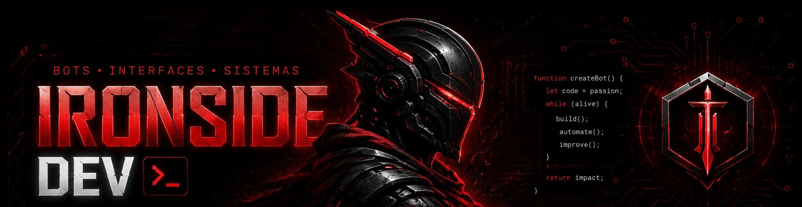

<div align="center">



<br>


<br>


</div>

---

```rust
pub struct Ironside {
    role: &'static str,
    primary_stack: &'static str,
    superpower: &'static str,
}

impl Ironside {
    pub const fn new() -> Self {
        Self {
            role: "Bot Developer & Frontend Builder",
            primary_stack: "TypeScript + React + Bun 🐰",
            superpower: "Transforming ideas into working systems",
        }
    }

    pub fn current_mission(&self) -> &str {
        "Building bots, interfaces and automation that scale"
    }

    pub fn philosophy(&self) -> &str {
        "Code with purpose. Automation with impact."
    }
}
```

---

<div align="center">

## 🤖 Bots & Automation


---

## ⚛️ Frontend


---

## 🧠 Logic & Scripting


</div>

---

<div align="center">

# 🚀 Featured Projects

</div>

## 🍕 [iPizzaria](https://github.com/IronsSideDEV/ipizzaria)

> Cardápio digital com carrinho de compras e pedido direto via WhatsApp. Cliente escolhe os itens, coloca o endereço e finaliza. A mensagem chega pronta para o estabelecimento.

`React` `TypeScript` `Vite` `WhatsApp API`

---

## 🖥️ [IronDesk](https://github.com/IronsSideDEV/irondesk)

> ERP/PDV completo com controle de estoque, frente de caixa e impressão de cupom. Sistema construído para operações reais.

`React` `TypeScript` `Bun` `PDV`

---

## 🛋️ [Lumora CRM](https://github.com/IronsSideDEV/lumora-crm)

> CRM de agendamento e gestão para empresas de higienização de estofados. Controle de clientes, histórico de serviços e agenda integrada.

`TypeScript` `React` `CRM`

---

<div align="center">

# 🐍 My Contributions


</div>
